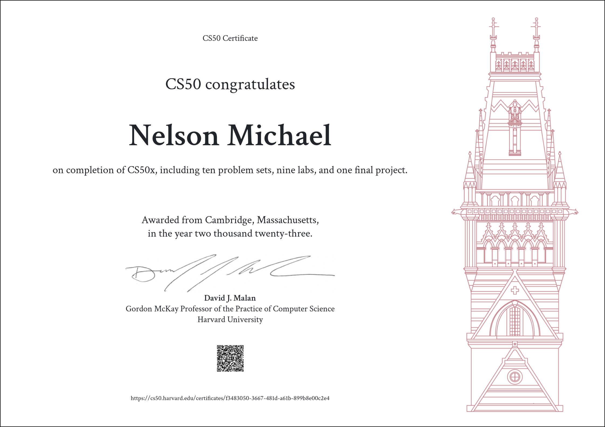

# CS50’s Introduction to Computer Science

### These are my solutions for CS50’s Introduction to Computer Science 2023.

## :warning: Disclaimer:

### ❗ **The following codes are for educational purpose only and not intended to be used / submitted as your own solutions.**

### ❗ **Cheating violates the [Academic Honesty](https://cs50.harvard.edu/x/2023/honesty/) of the course, not to mention it's totally pointless if you actually want to learn programming.**

 

## Table of Contents

### [Week 1](/week%201/) - [C]

- [Hello](/week%201/hello/hello.c)
- [Mario-less](/week%201/mario-less/mario.c)
- [Mario-more](/week%201/mario-more/mario.c)
- [Cash](/week%201/cash/cash.c)
- [Credit](/week%201/credit/credit.c)

### [Week 2](/week%202/) - [Arrays]

- [Bulbs](/week%202/bulbs/bulbs.c)
- [Scrabble](/week%202/scrabble/scrabble.c)
- [Readability](/week%202/readability/readability.c)
- [Substituion](/week%202/substitution/substitution.c)
- [Wordle](/week%202/wordle/wordle.c)

### [Week 3](/week%203/) - [Algorithms]

- [Sort](/week%203/sort/)
- [Plurality](/week%203/plurality/plurality.c)
- [Tideman](/week%203/tideman/tideman.c)

### [Week 4](/week%204/) - [Memory]

- [Filter-less](/week%204/filter-less/)
- [Reverse](/week%204/reverse/)

### [Week 5](/week%205/) - [DataStructures]

- [Inheritance](/week%205/inheritance/inheritance.c)
- [speller](/week%205/speller/speller.c)

### [Week 6](/week%206/) - [Python]

- [DNA](/week%206/dna/dna.py)
- [Sentimental-credit](/week%206/sentimental-credit/credit.py)
- [Sentimental-hello](/week%206/sentimental-hello/hello.py)
- [Sentimental-mario](/week%206/sentimental-mario-more/mario.py)
- [Sentimental-readability](/week%206/sentimental-readability/readability.py)

### [Week 7](/week%207/) - [SQL]

- [Fiftyville](/week%207/fiftyville/)
- [Movies](/week%207/movies/)
- [Songs](/week%207/songs/)

### [Week 8](/week%208/) - [HTML, CSS, JavaScript]

- [Homepage](/week%208/homepage/)
- [Trivia](/week%208/trivia/)

### [Week 9](/week%209/) - [Flask]

- [Birthdays](/week%209/birthdays/)
- [Finance](/week%209/finance/)
